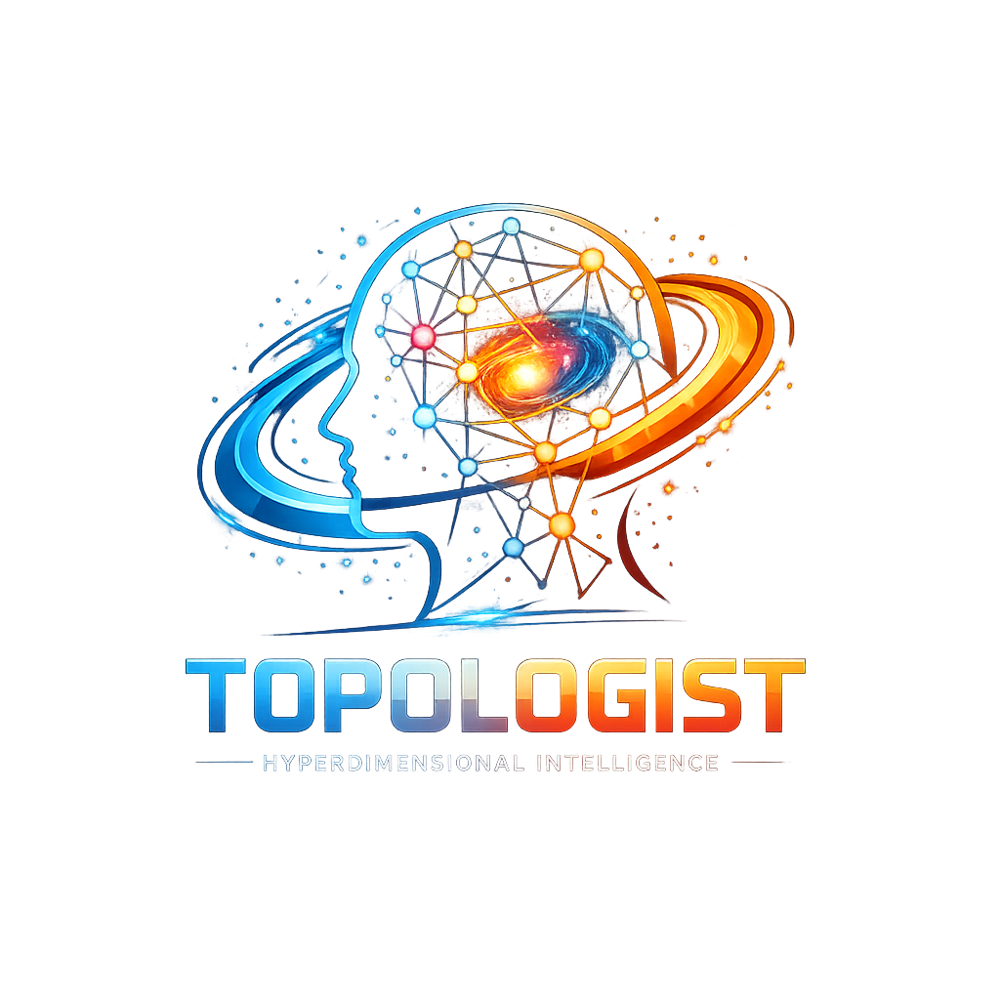

# Topologist

<p align="center">
  
</p>

A production-hardened **hyperdimensional neuro-symbolic topology system** in Python.

Topologist combines:

- **Hyperdimensional Computing / Vector Symbolic Architecture** for robust distributed representations.
- **Neuro-symbolic graph topology** using NetworkX.
- **Rule-based inference** over symbolic relations.
- **Topology analytics** including PageRank centrality, communities, shortest paths, drift, and anomaly scoring.
- **Persistence and export** to JSON, GraphML, and Mermaid.
- **CLI tooling** for demos and inspection.

---

## Why this exists

Most symbolic graph systems are explainable but brittle. Most neural/vector systems are robust but opaque.

Topologist sits between the two:

```text
Symbolic entities and relations
        ↓
Hyperdimensional encoding
        ↓
Topology graph
        ↓
Reasoning + analytics + anomaly detection
```

Each node and relation is stored symbolically, but also encoded into a high-dimensional bipolar hypervector. This gives you a graph that is queryable and explainable while also having a distributed topology-level memory state.

---

## Install

```bash
pip install topologist
```

For development without installing, ensure the package is in the Python path:

```bash
pip install -e .
python examples/demo.py
```

---

## Quick start

```python
from topologist import Topologist
from topologist.models import ReasoningRule

system = Topologist()

system.add_edge("Neuron", "connects_to", "Synapse", confidence=0.95)
system.add_edge("Synapse", "supports", "Memory", confidence=0.90)
system.add_edge("HDC", "models", "Memory", confidence=0.85)

created = system.apply_rule(
    ReasoningRule(
        relation_a="connects_to",
        relation_b="supports",
        inferred_relation="indirectly_supports",
        min_confidence=0.5,
    )
)

system.update_global_state(take_snapshot=True)

print("Created inferred edges:", created)
print("Centrality:", system.centrality())
print("Communities:", system.communities())
print("Nearest nodes:", system.nearest_nodes("Memory"))
print("Path:", system.shortest_path("Neuron", "Memory"))

system.save("topology.json")
```

Streaming example

```bash
# Run the streaming demo which ingests events, applies inference,
# snapshots state, computes drift, and scores anomalies.
python examples/streaming_topology.py
```

---

## CLI

Create a demo topology:

```bash
topologist demo --output topology.json
```

Inspect it:

```bash
topologist inspect topology.json
```

Export Mermaid:

```bash
topologist mermaid topology.json --output topology.mmd
```

---

## Main features

### 1. Hyperdimensional item memory

Stable symbols are encoded into bipolar vectors:

```text
symbol → {-1, +1}^D
```

The engine supports:

- Binding: elementwise multiplication
- Bundling: majority superposition
- Permutation: cyclic shifts for order/role encoding
- Similarity: cosine similarity

### 2. Symbolic topology graph

The graph is a `networkx.MultiDiGraph`, so it supports multiple relation types between the same source and target.

Example:

```text
HDC --models--> Memory
HDC --enhances--> KnowledgeGraph
KnowledgeGraph --supports--> Reasoning
```

### 3. Rule-based inference

Rules operate over two-hop motifs:

```text
A --relation_a--> B
B --relation_b--> C
----------------------
A --inferred_relation--> C
```

### 4. Drift detection

The global graph state is bundled into a single hypervector snapshot.

```python
system.update_global_state(take_snapshot=True)
drift = system.topology_drift()
```

This lets you measure how much the topology has changed over time.

### 5. Anomaly scoring

Candidate relations can be compared against the global topology state:

```python
score = system.relation_anomaly_score("A", "unexpected_relation", "B")
```

Higher scores mean the relation is less aligned with the current topology memory.

### 6. Confidence decay

Knowledge that is not reinforced can gradually lose confidence:

```python
system.decay_confidence()
```

This is useful for agent memory, dynamic knowledge graphs, cybersecurity events, medical evidence tracking, and live topology streams.

---

## Project structure

```text
topologist/
├── topologist/
│   ├── __init__.py
│   ├── cli.py
│   ├── config.py
│   ├── engine.py
│   ├── exceptions.py
│   ├── hdc.py
│   ├── io.py
│   ├── models.py
│   └── visualization.py
├── examples/
│   ├── demo.py
│   └── streaming_topology.py
├── tests/
│   ├── test_engine.py
│   └── test_hdc.py
├── pyproject.toml
└── README.md
```

---

## Run tests

```bash
pytest -q
```

---

## Production hardening included

This package includes:

- Typed modules
- Pydantic validation
- Custom exceptions
- Save/load roundtrip support
- CLI entrypoint
- Config object
- Test suite
- Export helpers
- No notebook-only assumptions
- No hidden API dependency
- Deterministic seed support
- Dimension validation
- Confidence decay
- Snapshot capping

---

## Good next upgrades

Useful next layers would be:

1. PyTorch Geometric bridge for GNN message passing.
2. Streaming event ingestion from Kafka, Redis Streams, or WebSockets.
3. Approximate nearest-neighbour search for large item memories.
4. Rule DSL with richer multi-hop inference.
5. OpenTelemetry tracing.
6. FastAPI service wrapper.
7. SQLite/Postgres persistence adapter.
8. Agent memory adapter for Claude Code, OpenClaw, or local LLM agents.

---

## License

MIT
